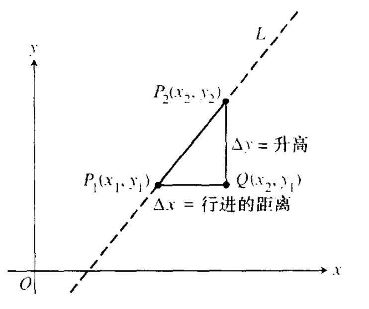
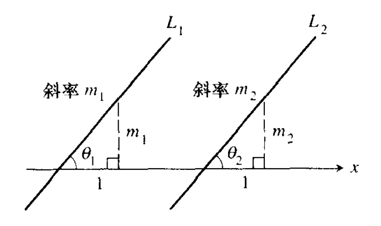

# 托马斯微积分

## 0. 预备知识

### 0.1. 直线

#### 增量

##### 定义

在平面直角坐标系中，若一个质点从 $(x_1, y_1)$ 位移到 $(x_2, y_2)$，其坐标的增量为：

* **水平增量：**  $\Delta x = x_2 - x_1$
* **垂直增量：** $\Delta y = y_2 - y_1  $

> 增量取值范围为 $(-\infty, +\infty)$

#### 直线的斜率

##### 定义

设点 $P_1(x_1, y_1)$ 和 $P_2(x_2, y_2)$ 是**非垂直**直线 L 上的两个点, L 的斜率为:

$$
m = \frac{\Delta y}{\Delta x} = \frac{y_2 - y_1}{x_2 - x_1}
$$

> 垂直直线没有斜率， 因为其 $\Delta x = 0$ 没有意义

##### 图形表示

#### 平行线和垂直线

##### 平行线

直角坐标系中直线 $L_1$ 与 $L2$ 若平行,
其中 $\Theta_1$ 和 $L_2$ 分别是 $L_1$ 和 $L_2$ 与横坐标的夹脚,
$m_1$ 和 $m_2$ 分别为 $L_1$ 与 $L_2$ 的斜率, 则:

$\because \Theta_1 = \Theta_2$

$\therefore tan\Theta_1 = tan\Theta_2$

$\therefore \frac{m_1}{1} = \frac{m_2}{1}$

$\therefore m_1 = m_2$

##### 垂直线

TODO:

#### 直线的方程

#### 应用

#### 用计算器来做回归分析

### 0.2. 函数和图形

### 0.3. 指数函数

### 0.4. 反函数和对数函数

### 0.5. 三角函及其反函数

### 0.6. 参数方程

### 0.7. 对变化进行建模

## 1. 极限和连续性

### 1.1. 变化率和极限

### 1.2. 求极限和单侧极限

### 1.3. 与无穷有关的极限

### 1.4. 连续性

### 1.5. 切线

## 2. 导数

### 2.1. 作为函数的导数

### 2.2. 作为变化率的导数

### 2.3. 积、商以及负幂的导数

### 2.4. 三角函数的导数

### 2.5. 链式法则

### 2.6. 隐函数微分法

### 2.7. 相关变化率

## 3. 导数的应用

### 3.1. 函数的极值

### 3.2. 中值定理和微分方程

### 3.3. 图形的形状

### 3.4. 自洽微分方程的图形解

### 3.5. 建模和最优化

### 3.6. 线性化和微分

### 3.7. Newton 法

## 4. 积分

### 4.1. 不定积分、微分方程和建模

### 4.2. 积分法则：替换积分法

### 4.3. 用有限和来估计

### 4.4. 黎曼和与定积分

### 4.5. 中值定理和基本定理

### 4.6. 定积分的变量替换

### 4.7. 数值积分

## 5. 积分的应用

### 5.1. 切片法求体积和绕轴旋转

### 5.2. 以圆柱薄壳模式计算体积

### 5.3. 平面曲线的长度

### 5.4. 弹簧、泵吸和提升

### 5.5. 流体力

### 5.6. 矩和质心

## 6. 超越函数和微分方程

### 6.1. 对数

### 6.2. 指数函数

### 6.3. 反三角函数的导数：积分

### 6.4. 一阶可分离变量微分方程

### 6.5. 线性一阶微分方程

### 6.6. Euler 法：人口模型

### 6.7. 双曲函数

## 7. 积分方法，洛必达法则和反常积分

### 7.1. 基本积分公式

### 7.2. 分部积分

### 7.3. 部分分式

### 7.4. 三角替换

### 7.5. 积分表，计算机代数系统和 Monte Carlo 积分

### 7.6. 洛必达法则

### 7.7 反常积分

## 8. 无穷级数

### 8.1. 数列的极限

### 8.2. 子序列、有界序列和皮卡方法

### 8.3 无穷级数

### 8.4. 非负项级数

### 8.5. 交错级数、绝对收敛和条件收敛

### 8.6. 幂级数

### 8.7. Taylor 级数和 Maclaurin 级数

### 8.8. 幂级数的应用

### 8.9. Fourier 级数

### 8.10. Fourier 余弦和正弦级数

## 9. 平面向量和极坐标函数

### 9.1. 平面向量

### 9.2. 点积

### 9.3. 向量 - 值函数

### 9.4. 对抛射体运动建模

### 9.5. 极坐标和图形

### 9.6. 极坐标曲线的微积分

## 10. 空间中的向量和运动

### 10.1. 空间中的笛卡尔（直角）坐标和向量

### 10.2. 点积和叉积

### 10.3 空间中的平面和直线

### 10.4. 柱面和二次曲面

### 10.5. 向量值函数和空间曲线

### 10.6. 弧长和单位切向量 T

### 10.7. TNB 标架：加速度的切向分量和法向分量

### 10.8. 行星运动和人造卫星

## 11. 多元函数及其导数

### 11.1. 多元函数

### 11.2. 高维函数的极限和连续

### 11.3. 偏导数

### 11.4. 链式法则

### 11.5. 方向导数、梯度向量和切平面

### 11.6. 线性化和微分

### 11.7. 极值和鞍点

### 11.8. Lagrange 乘子

### 11.9. 带约束变量的偏导数

### 11.10. 两个变量的 Taylor 公式

## 12. 重积分

### 12.1. 二重积分

### 12.2. 面积、力矩和质心

### 12.3. 极坐标形式的二重积分

### 12.4. 直角坐标下的三重积分

### 12.5. 三维空间中的质量和矩

### 12.6. 柱坐标与球坐标下的三重积分

### 12.7. 多重积分中的变量替换

## 13. 向量场中的积分

### 13.1. 线积分

### 13.2. 向量场、功、环量和流量

### 13.3. 与路径无关、势函数和保守场

### 13.4. 平面的格林定理

### 13.5. 曲面面积和曲面积分

### 13.6. 参数化曲面

### 13.7. Stokes 定理

### 13.8. 散度定理及统一化理论
